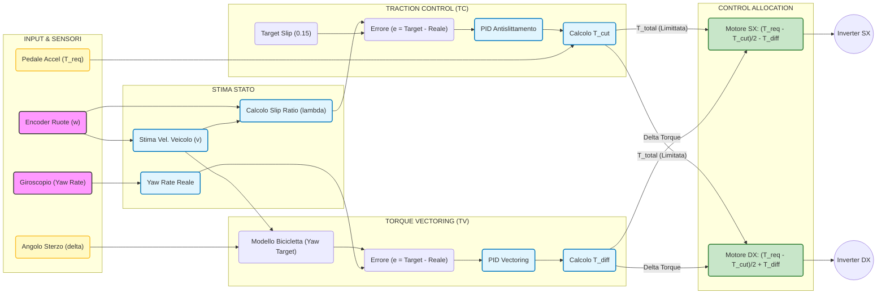

# Traction Control
Il controllo di trazione agisce sulle ruote motrici di una vettura e ha come obiettivo quello di mantenere lo slip ratio $\lambda$ tra il 10% e il 20%, dove la forza longitudinale tra pneumatico e asfalto è massima. Lo slip ratio è un parametro che descrive la differenza relativa tra la velocità lineare della ruota e la velocità del veicolo stesso.

## **Anti slittamento**
La prossima sezione prova a risolvere l'errore dello slittamento della ruota sull'asfalto.
A fronte dei calcoli è necessario recuperare i dati riguardanti tutte e quattro le velocità delle ruote, che nel nostro caso sono rilevati dai due encoder dei motori per l'asse posteriore e dalle ruote foniche sulle ruote dell'asse anteriore. Una volta che si hanno i dati bisogna darli in pasto ad un controllore PID, con lo scopo di minimizzare l'errore di slittamento $e(t)$, quindi la differenza tra lo slittamento desiderato e lo slittamento reale.

$$e(t)=\lambda_{target}-\lambda_{reale}$$

Un controllore PID è diviso in tre parti: proporzionale, integrale e derivativa. Una volta effettuati i calcoli vengono semplicemente sommati i risultati per generare un certo output.

$$u(t)= u_P(t) + u_I(t) + u_D(t)$$

**Proporzionale**

L'azione proporzionale reagisce all'errore istantaneo. In caso di forte slittamento, questa componente agisce tagliando la coppia in modo proporzionale allo slittamento. L'uscita si ottiene moltiplicando l'errore con una costante.

$$u_P(t)=K_P\cdot e(t)$$

Questa componente non è sufficiente per eseguire un controllo completo su un processo instabile perché per effettuare una correzione è necessario che $e(t)>0$. È anche importante capire che una costante $K_P$ troppo grande risulta in un sistema instabile che inizia ad oscillare in modo accentuato. Mentre se è troppo basso il sistema non sarà in grado di correggere lo slittamento.

**Integrale**

L'azione integrale permette di considerare la storia dell'errore. In caso di errore stazionario, quindi quando lo slittamento persiste nel tempo, l'integrale accumula l'errore e aumenta l'intervento del traction control.

$$u_{I}=K_{I}\cdot\int_{0}^te(\tau)d\tau$$

Questa parte fa in modo che si raggiunga sempre l'obiettivo del PID ma genera anche un problema: l'effetto **windup**. Se il valore persiste per un prolungato periodo di tempo, l'integrale cresce molto e può continuare a tagliare la coppia anche se la situazione si è stabilizzata e non c'è più slittamento.

**Differenziale**

Serve a smorzare gli errori che vengono dalla componente proporzionale. Se la velocità della ruota cambia repentinamente, quindi sta iniziando a slittare, questa componente interviene tempestivamente.

$$u_D(t) = K_d \cdot \frac{de(t)}{dt}$$

### **Implementazione**
L'uscita del PID non viene utilizzato per controllare direttamente la ruota ma agisce sulla coppia che viene inviata al motore.
Prima di tutto bisogna calcolare lo slip della gomma utilizzando la media della velocità delle ruote davanti per definire la velocità del veicolo.

$$\lambda = \frac{\omega \cdot r - v}{v}$$

 Successivamente bisogna definire un target ideale di slip, per esempio il 15%.

$$\lambda_{target}=15\%$$

I dati finiscono in pasto al PID che come output ha la variazione di coppia che dobbiamo applicare a quella richiesta per ridurre lo slittamento.

$$Coppia_{effettiva} = Coppia_{pilota} - U_{tot}$$

$U_{tot}$ risulta essere una coppia perché le costanti $K$ sono scalate in modo tale da trasformare quel valore in una coppia effettiva.
## **Torque vectoring**
Il torque vectoring è quel dispositivo che permette di erogare una coppia diversa per ogni ruota motrice della vettura in modo tale da rendere più fluide le virate ed evitare sovrasterzo e sottosterzo. La nostra auto ha solo due ruote motrici posteriori, quindi i seguenti calcoli e considerazioni sono eseguiti di conseguenza.

Concretamente l'obiettivo è quello di creare un momento di imbardata aggiuntivo intorno all'asse verticale della vettura. Il sistema utilizza vari sensori, tra i quali:

- Sensore dello sterzo per ottenere il dato riguardante la sterzata desiderata dal pilota.
- Accelerometro per ottenere l'angolo di imbardata attuale della vettura.
- Sensore di velocità.

Il momento desiderato viene calcolato come

$$M_{TV}=\Delta F_{x}\frac{W}2$$

Con $W$ distanza ruota-ruota (carreggiata) e $\Delta F_{x}$ la differenza di coppia tra le due ruote motrici. L'efficacia del torque vectoring aumenta all'aumentare della carreggiata perché aumenta il braccio di leva.

L'implementazione di questo sistema si divide nelle operazioni di feedfarward e feedback.

**Feedfarward**

Il controllore calcola l'imbardata desiderata $\dot{\psi}_{target}$ in base all'angolo di sterzata e alla velocità della vettura.

$$\dot{\psi}_{target} = \frac{v}{L + K_{us} \cdot v^2} \cdot \delta$$

Con $L$ che è il passo della vettura, $K_{us}$ coefficiente di sottosterzo e $\delta$ angolo di sterzo. una volta ottenuto il dato si da in pasto al secondo controllore PID che si occuperà di variare il $\Delta F_{x}$ in modo da ottenere l'imbardata target.

**Feedback**

Come nel controllo dello slittamento abbiamo un controllore PID che cerca di minimizzare l'errore di imbardata, calcolato come

$$e(t) = \dot{\psi}_{target} - \dot{\psi}_{actual}$$

- $e(t)<0$ corrisponde al sottosterzo
- $e(t)>0$ corrisponde al sovrasterzo

L'uscita del PID corrisponde ad una differenza di coppia da applicare ai due motori.

$$T_{Posterior\_SX} = \frac{T_{total}}{2} - T_{diff}$$

$$T_{Posterior\_DX} = \frac{T_{total}}{2} + T_{diff}$$

